<div align="center">

# Smart Fundis

### *Kazi yako, sifa yako.* Your work, your reputation.

**A verified-fundi marketplace for Kenya.** Fundis prove their skills on a short phone video. NVIDIA AI checks the work, and a human Expert confirms it.

Built for the **GOMYCODE × NVIDIA "Come Build with AI"** hackathon on 27 September 2026.

[**▶ View the pitch deck**](#pitch-deck) · [**📱 Try it on your phone**](#try-it-on-your-phone) · [**⚙️ Install**](#installation) · [**🔁 How it works**](#how-it-works)

[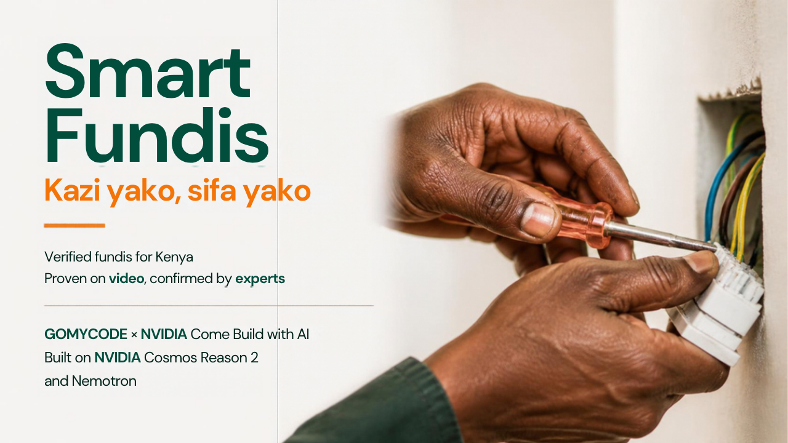](https://canva.link/xz2iw1d6jjlmb44)

</div>

> **Status: architecture phase.** The specs, ADRs, agent setup and build prompts are ready. The product code is written on build day, as the hackathon rules require. The screens below are **concept mockups**, and the real UI is designed in Stitch during slice V3. Everything prepared in advance is disclosed on the project card.

---

## Pitch deck

**[▶ Open the pitch deck in Canva](https://canva.link/xz2iw1d6jjlmb44)** (11 slides). Click any slide to open the deck.

| | |
| --- | --- |
|  | 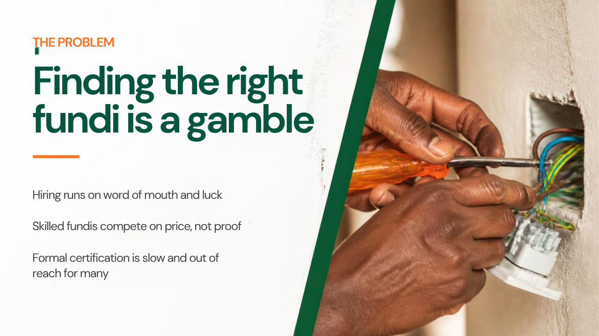 |
| 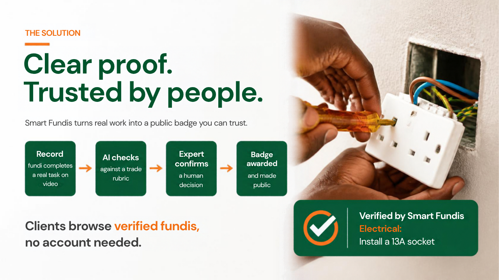 | 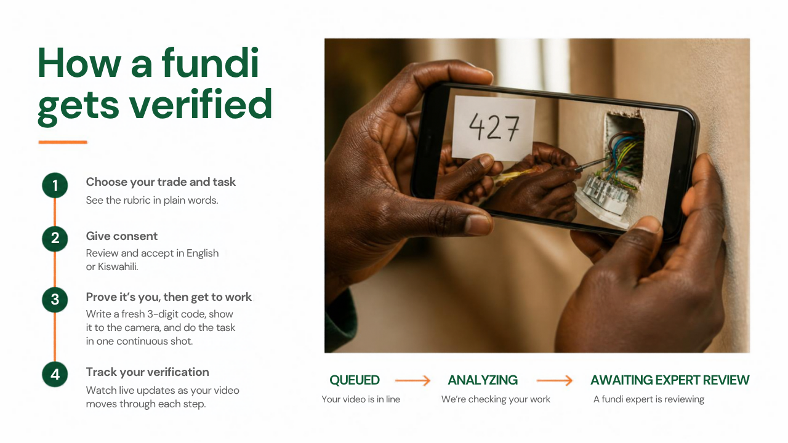 |
| 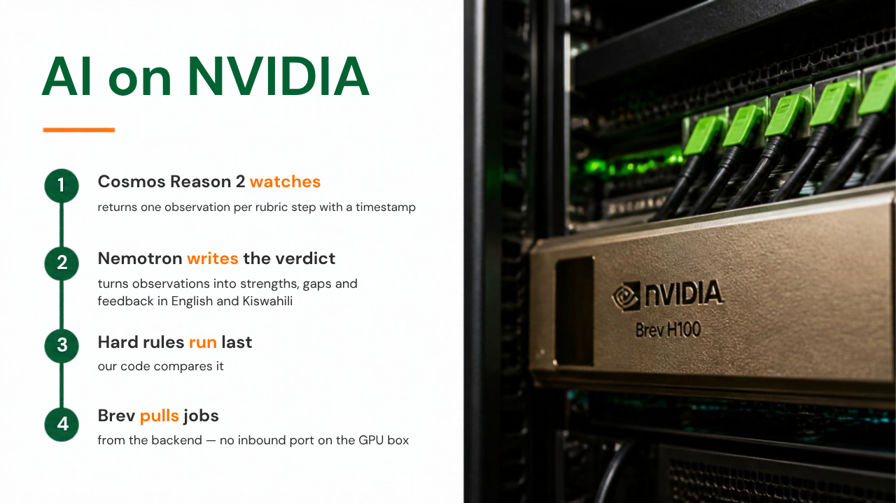 | 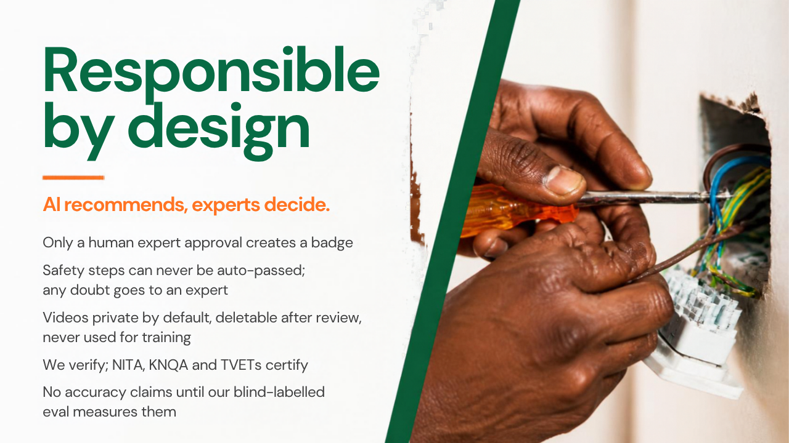 |
| 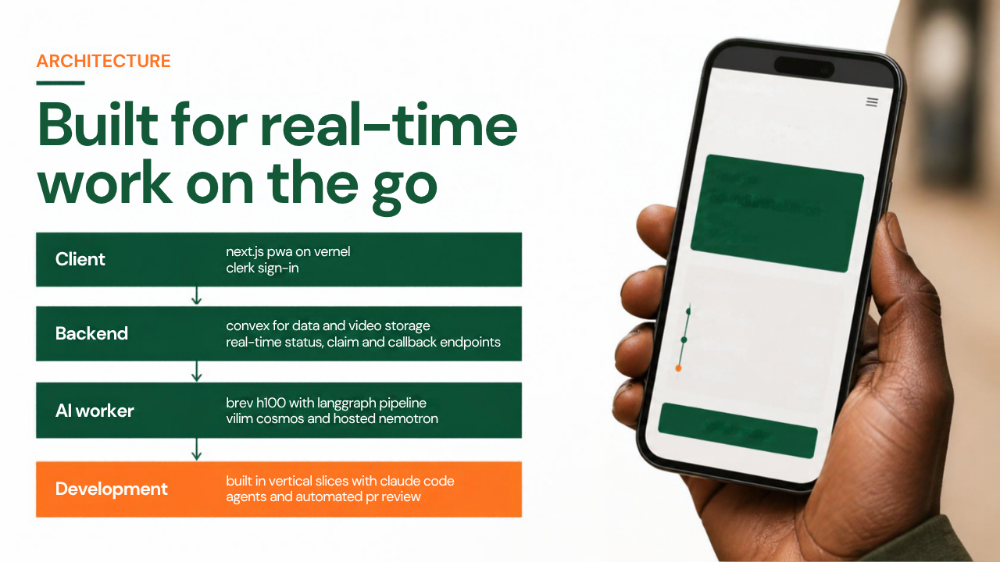 | 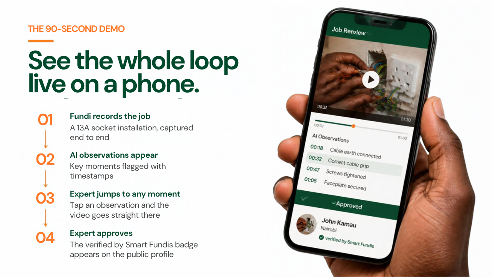 |
| 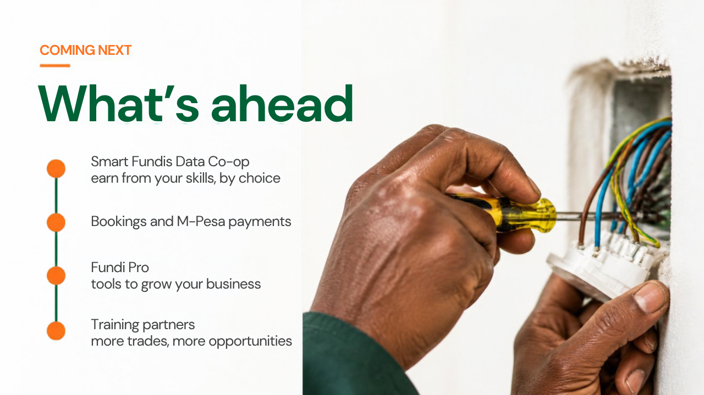 | 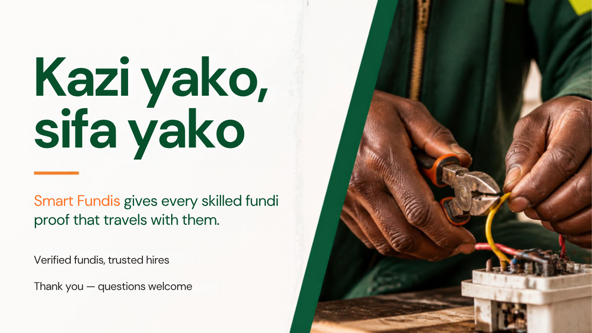 |
| 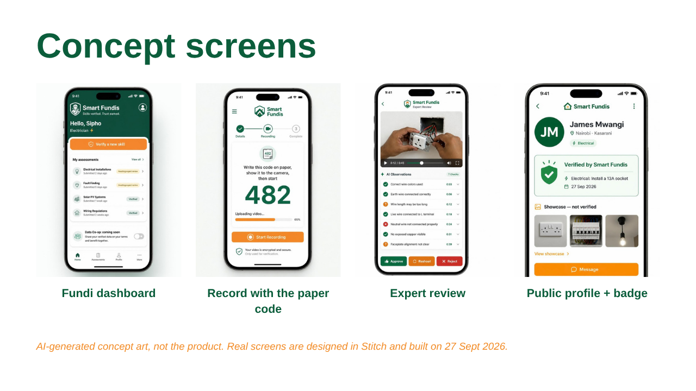 | |

---

## The problem, and our answer

Clients in Kenya can't tell a skilled fundi from an unskilled one. Skilled jua kali workers have no cheap, trusted way to prove what they can do.

**Smart Fundis** turns one real piece of work into proof that goes with the fundi:

```
Record  ──▶  AI checks  ──▶  Expert confirms  ──▶  Badge
(phone)     (NVIDIA Cosmos     (a human, always)    "Verified by Smart Fundis —
             + Nemotron)                              Electrical: Install a 13A socket · 27 Sep 2026"
```

- **The AI recommends, and Experts decide.** Only a human Expert's approval creates a Badge.
- **Safety steps are never auto-passed.** Any doubt goes to an Expert.
- **We verify; NITA, KNQA and TVETs certify.** We never use the word "certified".

---

## Try it on your phone

Smart Fundis is a **mobile-first PWA**, designed at 360 px for a mid-range Android phone on 4G.

| | |
| --- | --- |
| **Live app** | `APP_URL`. This will be the Vercel production URL from build day, and it's added here after the first prod promotion. |
| **Android (Chrome)** | Open the link → ⋮ menu → **Add to Home screen** |
| **iPhone (Safari)** | Open the link → Share → **Add to Home Screen** |
| **Sign in** | Email or Google |
| **Demo data** | The profiles tagged **"Demo: not a real verification"** are seeded examples. Any Badge without that tag is real. |

### Dashboards by role

Roles are **derived**, not chosen (ADR-18), and one person can hold several. The avatar menu shows the dashboards you have access to.

| Role | Dashboard | What you can do |
| --- | --- | --- |
| **Fundi** | `/fundi` | See your Badges, start "Verify a new skill", follow each Assessment's live status, read the AI feedback, delete a video once review is finished, "Show my profile in Find a fundi", and the Data Co-op interest toggle |
| **Expert** | `/expert` | See a queue of Assessments in your approved Trades only (never your own). Watch the video, tap an Observation to jump to that moment, then **Approve**, **Reshoot** or **Reject** with a note |
| **Admin** | `/admin` | Approve Expert applications, decide appeals when no other Expert is available, override any decision with a reason, see the audit log |
| **Client (no account)** | `/fundis`, `/f/[id]` | Browse Verified Fundis by Trade and see their Badges and Showcase links. Contact and booking are coming soon. |

### Concept screens


<sub>These are AI-generated concept art made with Canva, not the product. The real screens are generated from `design/stitch/prompts/`. Known gaps in the concept art: the dashboard shows a "Solar PV" Trade (the MVP has Electrical and Hairdressing only), and the profile shows a "Message" button (contact is hidden in the MVP). The names shown are invented.</sub>

---

## How it works

### 1. The fundi's journey

1. **Join.** "Join as a fundi" leads to sign-up (email or Google), then onboarding. A tile like "Electrical: Verify now" pre-selects that Trade.
2. **Pick a Task.** For example *Electrical: Install a 13A socket*. The Rubric is shown in plain words, with the safety steps marked.
3. **Consent.** The consent screen is shown in **English and Kiswahili** before any upload. It says who sees the video, that both AI and a human review it, and that it can be deleted after review. It is never used for AI training or the Data Co-op.
4. **Liveness code.** A new 3-digit code appears. **The fundi writes it on paper, shows it to the camera, then does the work in one continuous shot** (ADR-19).
5. **Record and upload** with the phone's own camera, in 10–90 s clips, with a progress bar and retry.
6. **Watch it live.** The status goes `queued → analyzing → awaiting review` with no refresh.
7. **Decision.** An Expert approves, asks for a reshoot, or rejects with a note. A rejection can be appealed **once**, and a different Expert decides the appeal.
8. **Badge.** It appears on the public profile, and the fundi appears on **Find a fundi**.

### 2. From upload to Badge

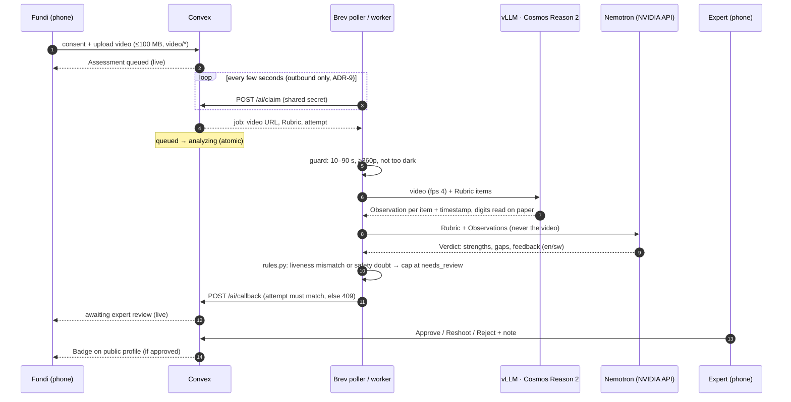

### 3. The Assessment lifecycle

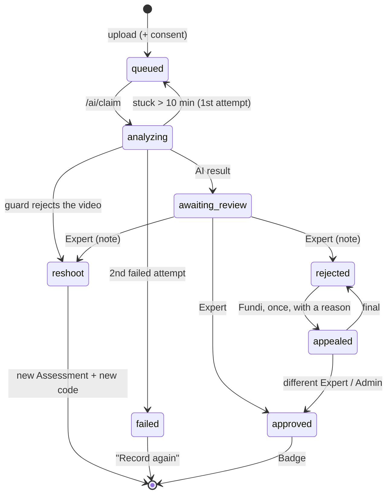

### 4. The AI can lower a verdict but never raise it

| Check | Outcome |
| --- | --- |
| The paper code Cosmos read (it isn't told the expected code) doesn't match, or can't be read | liveness `unclear` → at most **needs_review** |
| Any safety step is `no` or `unclear` | at most **needs_review** |
| A Rubric step has no Observation | that step is `unclear` |
| The video is too short, too long, too dark or too low-resolution | **reshoot**, with a reason in English and Kiswahili |

---

## Architecture

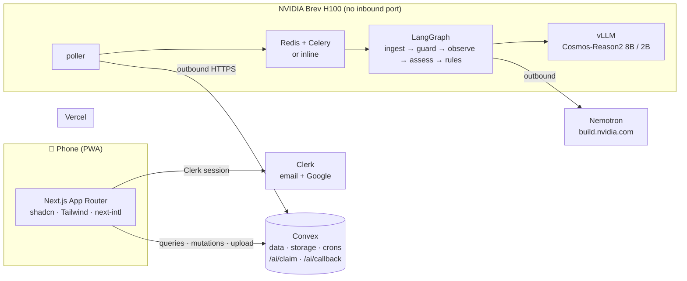

| Layer | Choice | Decision |
| --- | --- | --- |
| Web | Next.js App Router PWA, shadcn/ui, Tailwind, Vercel | ADR-1 |
| Auth | Clerk (email + Google), JWT template `convex`, roles derived in Convex | ADR-16, ADR-18 |
| Backend | Convex: schema, file storage, HTTP actions, crons | ADR-1, ADR-8 |
| Vision | Cosmos Reason 2 (8B, 2B fallback) on vLLM on a Brev H100 | ADR-3, ADR-12 |
| Reasoning | Nemotron through `ChatNVIDIA(...).with_structured_output(Verdict)` | ADR-4 |
| Pipeline | FastAPI + LangGraph, Redis + Celery, `QUEUE_MODE=inline` fallback | ADR-2, ADR-5 |
| Job flow | Brev **pulls** jobs from Convex | ADR-9 |

The full design is in **[docs/superpowers/specs/2026-09-25-architecture-design.md](docs/superpowers/specs/2026-09-25-architecture-design.md)**.

---

## Installation

> These steps describe the planned layout. The folders are created in slice **V0** on build day.

### Prerequisites

- Node 20+, pnpm 12 (`corepack enable`), Python 3.11+ with uv, git, and the [GitHub CLI](https://cli.github.com)
- Accounts:
  - [Clerk](https://clerk.com)
  - [Convex](https://convex.dev)
  - [Vercel](https://vercel.com)
  - [build.nvidia.com](https://build.nvidia.com) (API key)
  - [NVIDIA Brev](https://brev.nvidia.com)
  - [Hugging Face](https://huggingface.co/nvidia/Cosmos-Reason2-8B) (accept the model licence)
  - [LangSmith](https://smith.langchain.com) (optional)

### 1. Clone and install

```bash
git clone https://github.com/simpleHacker0893/smart-fundis.git
cd smart-fundis
pnpm install                      # pnpm workspace: web; convex deps at the root
```

### 2. Clerk

1. Create an application with **Email** and **Google** sign-in.
2. Create a **JWT template** named `convex` with the claims `email`, `email_verified` and `name`.
3. Copy the publishable key, the secret key, and the Frontend API URL.

### 3. Convex

```bash
pnpm dev:convex                   # convex dev: creates the dev deployment and pushes convex/
```

In the Convex dashboard, set these environment variables:

| Variable | Value |
| --- | --- |
| `CLERK_FRONTEND_API_URL` | your Clerk Frontend API URL |
| `ADMIN_EMAILS` | comma-separated admin emails (must be verified in Clerk) |
| `AI_SHARED_SECRET` | a long random string, **different in dev and prod** |

### 4. Web app

Create `web/.env.local` with these variables. Never commit it.

```bash
NEXT_PUBLIC_CONVEX_URL=https://<deployment>.convex.cloud
NEXT_PUBLIC_CLERK_PUBLISHABLE_KEY=pk_test_...
CLERK_SECRET_KEY=sk_test_...
```

```bash
pnpm dev                          # web on http://localhost:3000 (run pnpm dev:convex in a second terminal)
```

To test on your phone over your LAN, open `http://<your-computer-ip>:3000`. For camera capture over HTTPS, use the Vercel preview URL.

### 5. The AI worker

**Without a GPU, use the stub worker (slice V1).** It processes queued Assessments with a canned result, which is enough to see the whole loop:

```bash
cd ai-service
python -m venv .venv && source .venv/bin/activate   # Windows: .venv\Scripts\activate
pip install -r requirements.txt
CONVEX_SITE_URL=https://<deployment>.convex.site AI_SHARED_SECRET=... python scripts/stub_worker.py
```

**With a GPU, use the real worker on NVIDIA Brev (slice V2):**

```bash
brev create smart-fundis --gpu H100          # or use the Brev console
brev shell smart-fundis
git clone https://github.com/simpleHacker0893/smart-fundis.git && cd smart-fundis/ai-service
cp .env.example .env                         # VLLM_BASE_URL, COSMOS_MODEL, NVIDIA_API_KEY, NEMOTRON_MODEL,
                                             # CONVEX_SITE_URL, AI_SHARED_SECRET, REDIS_URL, QUEUE_MODE, LANGSMITH_*
./scripts/up.sh                              # vLLM (Cosmos-Reason2-8B), Redis, Celery worker, poller in tmux
curl localhost:8080/health                   # model loaded, Redis ok, queue mode
```

The Brev box never opens an inbound port. The poller only calls out to `CONVEX_SITE_URL`.

### 6. Tests

```bash
pnpm test                                    # env check, web tests, and convex-test once V0 #4 adds it
pnpm exec playwright test --project=mobile   # 360×740 end-to-end (web/e2e, from V1)
cd ai-service && pytest                      # rules.py, guard, "prompt never contains the code"
```

---

## How this repo is built

The repo is built **one vertical slice at a time**, by Claude Code agents with a human Architect.

| Slice | What you can demo at the end |
| --- | --- |
| V0 Skeleton | the app deployed, sign-in round trip |
| V1 Tracer bullet | consent → upload → stub AI → Expert approves → Badge |
| V2 Real AI | Cosmos + Nemotron on Brev, timestamp jumps, fallbacks |
| V3 Front door | Stitch landing page, onboarding, `/fundis`, Co-op card |
| V4 Judgement edges | Expert applications, appeals, overrides, video deletion |
| V5 Demo | demo seed, eval, backup video, project card |

Each slice runs this loop, with one prompt file per step in [`planning/prompts/`](planning/prompts/README.md):

```
grill (Matt Pocock grill-with-docs) → spec issue (to-spec) → tickets (to-tickets, vertical slices)
  → per ticket: implement test-first (tdd) → local /code-review → PR → Architect reviews by hand (D-10) → Architect merges
  → close the slice (/review-phase + 120x Builder Review) → next slice
```

- **Agents:** 9 role subagents in [`.claude/agents/`](.claude/agents), with rules in [`AGENTS.md`](AGENTS.md)
- **Domain language:** [`CONTEXT.md`](CONTEXT.md). **Decisions:** [`docs/adr/`](docs/adr) and [`planning/DECISIONS.md`](planning/DECISIONS.md)
- **Automated review:** [`.github/workflows/claude-review.yml`](.github/workflows/claude-review.yml) reviews every PR against the spec and the ticket's acceptance criteria. It's off for now (D-10), and switches on with the repo variable `CLAUDE_REVIEW_ENABLED`
- **Skills:** superpowers, mattpocock-skills, Convex, LangChain, Clerk, Stitch, Vercel React, Brev, and the NVIDIA skill finder (see [`docs/research-links.md`](docs/research-links.md))

---

## Responsible AI

- The AI recommends, and only a human Expert's approval creates a Badge.
- Consent is shown in English and Kiswahili before any upload. Videos are private and can be deleted after review, and they're never used for training.
- Safety steps can never be auto-passed (ADR-11).
- The eval clips are the team's own recordings plus licensed Pexels footage, labelled blind. There is **no YouTube or TikTok footage**, and we make no accuracy claims until they're measured.
- LangSmith traces are masked, and video URLs are never logged.
- **Known limitations:** a leaked video URL keeps working until the video is deleted (the fix is planned for the Pilot). The demo runs on Clerk's development instance. We haven't yet measured how well the AI reads handwritten codes.

## Roadmap: coming next

**Earn from your skills.** The **Smart Fundis Data Co-op** comes first, and joining will need its own specific consent. After that come bookings and M-Pesa, Fundi Pro, training partners, and more Trades. None of these is live yet.

## Prepared before build day (disclosure)

- **Documents:** the PRD, the architecture spec, the ADRs, `CONTEXT.md` and the `planning/` pack
- **Agent setup:** the agent and skill configuration, and the build prompts
- **Design and pitch:** the Stitch prompts, and this README with its concept images and pitch deck
- **Eval data:** the eval clip labels

All product code is written on 27 September 2026.
